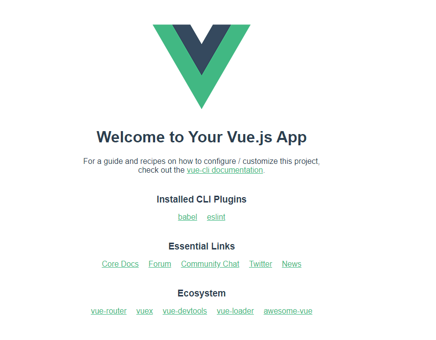

1. 全局安装vue-cli
```
npm install -g @vue/cli
```
vue-cli是一个脚手架，安装之后我们就可以在命令行中使用```vue```命令了。脚手架说通俗点，就是使用它可以帮助我们快速创建一个vue工程所必须的文件和配置，让我们更多注意力集中在代码编写上。如果有兴趣你可以自己从头搭建一个vue的工程，不建议初学者尝试，因为确实很复杂...

2. 使用vue-cli创建项目
```
vue create first-demo
```
出现选项，直接回车就行~不做过多介绍。
包管理器可以选择yarn，安装依赖的速度比npm会快哦。
yarn

3. 运行项目
```
cd first-demo
yarn serve
```
使用vue-cli创建的项目，会帮你自动安装依赖的，输入以上命令就可以运行项目啦~

