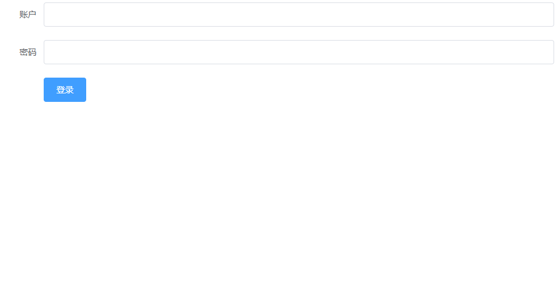
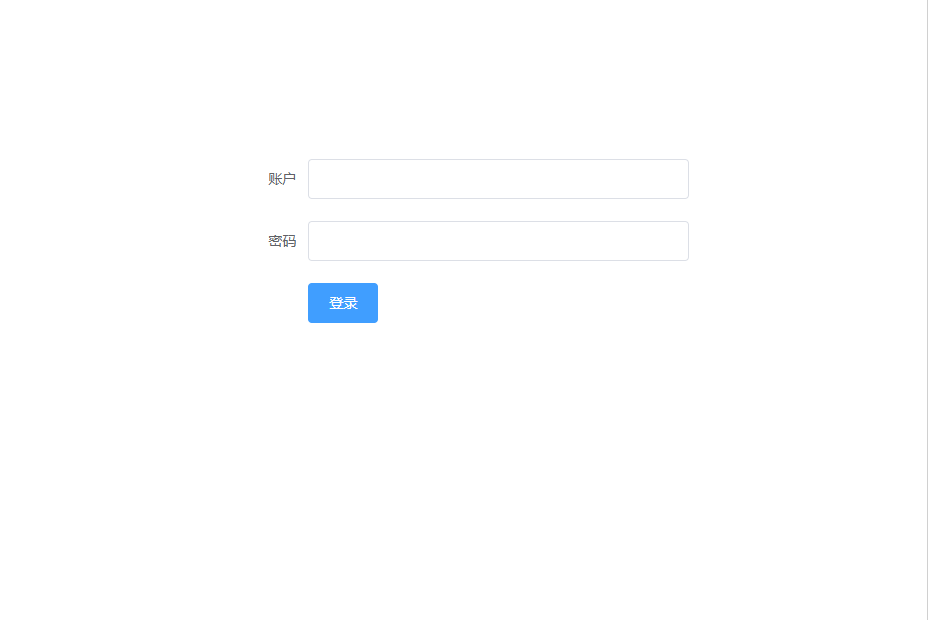

# 准备
在搭建项目之前，我们需要安装以下依赖
## elementUI

1. 安装
```
yarn add element-ui
# 或 npm i element-ui -S
```

2. 在项目中引入
   
在src/main.js中添加以下代码
```
import ElementUI from 'element-ui'
import 'element-ui/lib/theme-chalk/index.css'

Vue.use(ElementUI)
```

## vue-router

1. 安装
   
```
yarn add vue-router
# 或 npm install vue-router
```
2. 在项目中引入
   
在src/main.js中添加以下代码
```
import VueRouter from 'vue-router'
Vue.use(VueRouter)
```

## 引用完的src/main.js示例
```
import Vue from 'vue'
import App from './App.vue'
import ElementUI from 'element-ui'
import 'element-ui/lib/theme-chalk/index.css'
import VueRouter from 'vue-router'

Vue.use(VueRouter)
Vue.use(ElementUI)
Vue.config.productionTip = false

new Vue({
  render: h => h(App),
}).$mount('#app')

```

# 配置路由
1. 我们先简单的创建两个页面，登录和首页
进入components目录，删除自带的helloWorld.vue组件。新建home.vue和login.vue组件

login.vue
```
<template>
    <div>
        登录
    </div>
</template>
```
home.vue

```
<template>
    <div>
        首页
    </div>
</template>
```
提示：以下代码会报错，原因是template标签内部必须**有且只有一个**根节点
```
<template>
  登录
</template>
```
2. 修改App.vue文件
```
<template>
  <div id="app">
    <router-view></router-view>
  </div>
</template>

<script>

export default {
  name: 'App'
}
</script>
```
```<router-view></router-view>```表示此处区域的内容是动态的，随着路由的变化而显示不同的内容。

那究竟是什么路由显示什么页面呢？接下来我们来制定路由与页面的对应规则吧。

3. 配置路由

新建src/router.js文件
```
// 0. 导入VueRouter
import VueRouter from "vue-router";
// 1. 定义 (路由) 组件。
import Home from "@/components/home.vue";
import Login from "@/components/login.vue";

// 2. 定义路由
const routes = [
  { path: '/home', component: Home },
  { path: '/login', component: Login }
]

const router = new VueRouter({
  routes // (ES6的缩写写法) 相当于 routes: routes 
})

// 3. 导出，以便在main.js中引入
export default router;
```

```new VueRouter({routes})```中的参数是ES6的简写写法，相当于{routes:routes}

详细请看[属性的简洁表示法](https://es6.ruanyifeng.com/#docs/object#%E5%B1%9E%E6%80%A7%E7%9A%84%E7%AE%80%E6%B4%81%E8%A1%A8%E7%A4%BA%E6%B3%95)

4. 在main.js中引入并使用vuerouter

```
import Vue from 'vue'
import App from './App.vue'
import ElementUI from 'element-ui'
import 'element-ui/lib/theme-chalk/index.css'
import VueRouter from 'vue-router'

import router from "./router";  //新增
Vue.use(VueRouter)
Vue.use(ElementUI)
Vue.config.productionTip = false

new Vue({
  router, //新增
  render: h => h(App),
}).$mount('#app')


```

5. 大功告成，现在访问以下链接就可以访问到对应的页面了
- http://localhost:8080/#/home
- http://localhost:8080/#/login


# 修改登录界面样式

我们事先引入了elementUI，就让我们使用它来完成一个登陆页面吧~

## 登录表单初实现
1. 修改login.vue的代码
```
<template>
  <el-form ref="form" :model="loginInfo" label-width="80px">
    <el-form-item label="账户">
      <el-input v-model="loginInfo.username"></el-input>
    </el-form-item>
    <el-form-item label="密码">
      <el-input v-model="loginInfo.password" show-password></el-input>
    </el-form-item>
    <el-form-item>
      <el-button type="primary">登录</el-button>
    </el-form-item>
  </el-form>
</template>
<script>
export default {
  data() {
    return {
      loginInfo: {
        username: "",
        password: "",
      },
    };
  },
};
</script>

```
此时，我们使用elementUI的el-form作为template的唯一根标签，所以是没问题的，不会报错。

然而目前有些丑，我们来试试把宽度调成屏幕的一半,为el-form添加class

2. 修改form的宽度
   
```
<el-form ref="form" :model="loginInfo" label-width="80px" class="login-m">
```
并在当前的文件（login.vue）的最末加入样式
```
<style scoped>
    .login-m {
        width: 50%;
    }
</style>
```
至此，我们应该发现了，`.vue`文件由三部分构成`<template>`,`<script>`,`<css>`，对应了html，JavaScript，css。
另外，我们经常会看到style标签中有个`scoped`，它的作用时，内部的样式只对当前文件的`<template>`起作用。

我们举个例子，在过去传统开发前端时，在html中声明`.login-m`的样式，样式会对页面内的所有类是login-m的标签起作用。
而在开发vue时加入了scoped属性，表现`.login-m`只对当前所编写的`.vue`文件内的类是login-m的标签起作用，也就是说如果在`home.vue`中有个`<div class='login-m'></div>`，刚才写的样式不会影响到它，但是如果没有写scoped属性，就会影响了！！

推荐每个vue文件的style标签都加入scoped属性，限制其**作用域（scope）**。

## 实现水平居中

宽度现在确实变了，不过我们希望它水平垂直居中，在过去其实并不简单，近些年的flex布局还算方便。

由于我们希望让form居中，在flex中视为子元素（被称为flex项目），我们必须要给其包裹一层父元素（被称为flex容器）。

[阮一峰：Flex 布局教程：语法篇](https://www.ruanyifeng.com/blog/2015/07/flex-grammar.html)
```
<template>
<div class="root">
  <el-form ref="form" :model="loginInfo" label-width="80px" class="login-m">
    //...省略form内部的代码
  </el-form>
</div>
</template>
```

```
<style scoped>
    .login-m {
        width: 50%;
    }
    .root {
        display: flex;
        justify-content: center;
        align-items: center;
        height: 500px;  
    }
</style>
```
flex实现垂直居中，父元素必须设置高度，这里的“500px”是我随便给他了个值。




# 加入跳转逻辑

我们暂时先不再追求美观了，现在加入点击登录按钮，跳转到首页的逻辑吧。

由于没有后端，我们暂定当账户和密码为"admin"时，才算登录成功。

1. 为按钮绑定事件

```
<el-button type="primary" @click="login">登录</el-button>
```

```
<script>
export default {
  data() {
    //...省略了，主要看下面新加的methods
  },
  methods: {
      login() {
          if(this.loginInfo.username === "admin" && this.loginInfo.password === "admin") {
              this.$router.push('home')
          }
      }
  }
};
</script>
```
至此，输入用户名admin和密码admin就可以登录跳转啦~

注：
- JavaScript中有 ===（全等）和 ==（相等），1 === "1" //false  1=='1' //true。可以适当了解下，记住多数情况用 === 和!== 就好。
- `this.$router`是什么? this表示当前的vue实例，是的没错，一个`.vue`都会有一个自己的实例。`$`符号是一种命名规范，表示的实例上的方法。现在可以不需要理解，不过要记住，`this.$router`，有个`$`，我经常写成`this.router`导致经常出问题。
- 由于此处时有一定逻辑的跳转（只有当用户密码合法时才能跳转），我们使用的是[编程式的导航](https://router.vuejs.org/zh/guide/essentials/navigation.html)。而对于哪种只要点一下就能跳转，一般通过使用`<router-link>`实现，这个你可能之前没见过，但是实际上它最后会被编译成的是`<a>`标签


